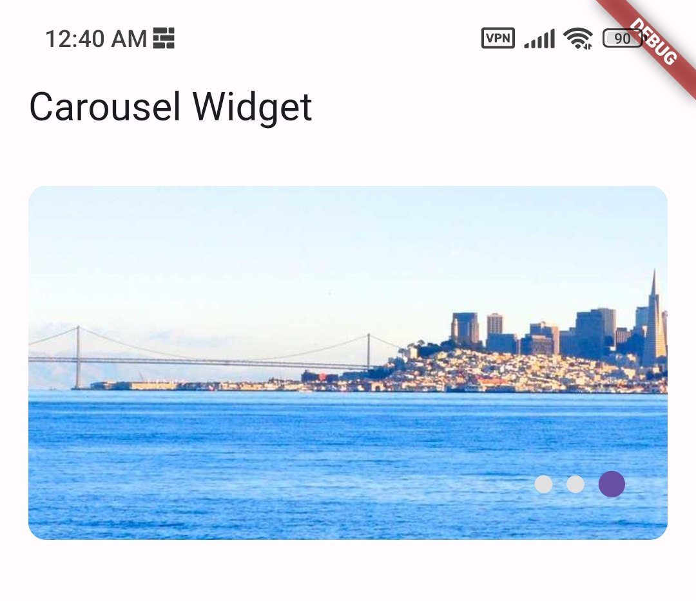

<!--
This README describes the package. If you publish this package to pub.dev,
this README's contents appear on the landing page for your package.

For information about how to write a good package README, see the guide for
[writing package pages](https://dart.dev/guides/libraries/writing-package-pages).

For general information about developing packages, see the Dart guide for
[creating packages](https://dart.dev/guides/libraries/create-library-packages)
and the Flutter guide for
[developing packages and plugins](https://flutter.dev/developing-packages).
-->
<!--
TODO: Put a short description of the package here that helps potential users
know whether this package might be useful for them. -->

# wonderful images carousel
a wonderful images carousel for flutter

<!-- screenshots -->



## Features

- [x] Display images in a carousel
- [x] cache images
- [x] auto play
- [x] custom indicator size & colors
- [x] custom indicator position
- [x] custom carousel size
- [x] custom carousel radius
- [x] custom carousel margin
- [x] custom carousel background color

## Getting started

### 1. Add dependency to your pubspec.yaml

```yaml
dependencies:
  wonderful_images_carousel: ^0.0.1
```

### 2. Import package in dart file

```dart

import 'package:wonderful_images_carousel/wonderful_images_carousel.dart';

```

### 3. Use the widget

```dart
 final List<String> images = [
    "https://picsum.photos/id/45/1080/1920",
    "https://picsum.photos/id/237/1080/1920",
    "https://picsum.photos/id/74/1080/1920",
  ];


    @override
    Widget build(BuildContext context) {
        return Scaffold(
            appBar: AppBar(
            title: Text(widget.title),
            ),
            body: WonderfulImagesCarousel(
            images: images,
            ),
        );
        }
```

### custom indicator size & colors

```dart

    @override
    Widget build(BuildContext context) {
        return Scaffold(
            appBar: AppBar(
            title: Text(widget.title),
            ),
            body: WonderfulImagesCarousel(
            images: images,
            indicatorSize: 10,
            indicatorActiveColor: Colors.red,
            indicatorInactiveColor: Colors.blue,
            ),
        );
        }
```

### properties

 <!-- /// [images] is a list of images url
  final List images;

  /// [height] is the height of the carousel , default is 200
  final double? height;

  /// [width] is the width of the carousel , default is the width of the screen
  final double? width;

  /// [borderRadius] is the border radius of the carousel , default is 10
  final double? borderRadius;

  /// [backgroundColor] is the background color of the carousel , default is grey[300]
  final Color? backgroundColor;

  /// [indicatorColor] is the color of the indicator , default is the primary color of the app
  final Color? indicatorColor;

  /// [unselectedIndicatorColor] is the color of the unselected indicator , default is grey[300]
  final Color? unselectedIndicatorColor;

  /// [indicatorSize] is the size of the indicator , default is 15
  final double? indicatorSize;

  /// [unSelectedIndicatorSize] is the size of the unselected indicator , default is 10
  final double? unSelectedIndicatorSize;

  /// [indicatorSpacing] is the spacing between the indicators , default is 4
  final double? indicatorSpacing;

  /// [autoSlide] is a boolean to enable auto slide , default is true
  final bool? autoSlide;

  /// [autoSlideDuration] is the duration of the auto slide , default is 6 seconds
  final int? autoSlideDuration;

  /// [slideDuration] is the duration of the slide , default is 300 milliseconds
  final int? slideDuration;

  /// [slideCurve] is the curve of the slide , default is Curves.easeIn
  final Curve? slideCurve;

  /// [loadingIndicatorWidget] is the widget to show while loading the image from the network
  final Widget? loadingIndicatorWidget;

  /// [edgeMargin] is the margin of the container , default is 16
  final EdgeInsetsGeometry? edgeMargin;

  /// [indicatorPositioned] is the positioned of the indicator , default is bottom: 20 , right: 20
  final Positioned? indicatorPositioned; -->

| property                 | description                                             | default                     |
| ------------------------ | ------------------------------------------------------- | --------------------------- |
| images                   | list of images url                                      | required                    |
| height                   | height of the carousel                                  | 200                         |
| width                    | width of the carousel                                   | width of the screen         |
| borderRadius             | border radius of the carousel                           | 10                          |
| backgroundColor          | background color of the carousel                        | grey[300]                   |
| indicatorColor           | color of the indicator                                  | primary color of the app    |
| unselectedIndicatorColor | color of the unselected indicator                       | grey[300]                   |
| indicatorSize            | size of the indicator                                   | 15                          |
| unSelectedIndicatorSize  | size of the unselected indicator                        | 10                          |
| indicatorSpacing         | spacing between the indicators                          | 4                           |
| autoSlide                | enable auto slide                                       | true                        |
| autoSlideDuration        | duration of the auto slide                              | 6 seconds                   |
| slideDuration            | duration of the slide                                   | 300 milliseconds            |
| slideCurve               | curve of the slide                                      | Curves.easeIn               |
| loadingIndicatorWidget   | widget to show while loading the image from the network | CircularProgressIndicator() |
| edgeMargin               | margin of the container                                 | 16                          |
| indicatorPositioned      | positioned of the indicator                             | bottom: 20 , right: 20      |
